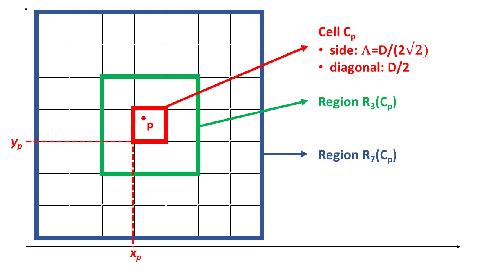

# INP7079233 - BIG DATA COMPUTING 2023-2024 (prof. Pietracaprina and Silvestri)

## Assignment of Homework 1

The purpose of the first homework is to get acquainted with Spark and with its use to implement MapReduce algorithms. In preparation for the homework, you must set up your environment following the instructions given in Moodle Exam, in the same section as this page. After the set up is complete, test it using the WordCountExample program (Java or Python), and familiarize with the Spark methods it uses. The Introduction to Programming in Spark may turn out useful to this purpose.

**OUTLIER DETECTION.** In the homework, you must implement and compare exact and approximate algorithms to detect outliers in a large dataset. Outlier (or anomaly) detection is a fundamental task in data analysis but it is often very expensive from a computational point of view.  We will use the following definition of outlier. Let $S$ be a set of $N$ points from some metric space and, for each $p \in S$ let $B_S(p,r)$ denote the set of points of $S$ at distance at most $r$ from $p$.  For given parameters $M,D>0$, an $(M,D)$-outlier (w.r.t. $S$) is a point $p \in S$ such that $|B_S(p,D)| \leq M$. Note that $p \in B_S(p,D)$, hence $|B_S(p,D)|$ is always at least 1. The problem that we want to study is the following: given $S,M,$ and $D$, mark each point $p \in S$ as *outlier*, if it is an $(M,D)$-outlier, and *non-outlier* otherwise.  For simplicity, we will consider inputs $S \subset \mathbb{R}^2$ and the standard Euclidean distance.

**Exact Algorithm.** The problem can be solved straighforwardly, by computing all $N (N-1)/2$ pairwise distances among the points, but, unfortunately, this strategy is impractical for very large $N$. 

**Approximate Algorithm.** This algorithm is a simple adaptation of an algorithm presented in Edwin M. Knorr, Raymond T. Ng, V. Tucakov: *Distance-Based Outliers: Algorithms and Applications*, VLDB J. 8(3-4): 237-253 (2000). Consider $\mathbb{R}^2$ partitioned into square cells of side $\Lambda = D/(2 \sqrt{2})$ (whose diagonal length is $D/2$). For each such cell $C$, we use an *identifier* defined by the pair of indices $(i,j)$, with $i,j \in \mathbb{Z}$, where $i \cdot \Lambda$ and $j \cdot \Lambda$ are the real coordinates of $C$'s bottom-left corner.  For a point $p =(x_p,y_p) \in C$ we define (see also picture below):

- $C_p$ = cell where $p$ resides, i.e., $C_p = (i,j)$ with $i=\lfloor x_p/\Lambda \rfloor$ and $j=\lfloor y_p/\Lambda \rfloor$.
- $R_3(C_p)$ = 3x3 grid of cells with $C_p$ in the middle.
- $R_7(C_p)$ = 7x7 grid of cells with $C_p$ in the middle.

Define also:

- $N_3(C_p)$ = number of points in $R_3(C_p) \cap S$.
- $N_7(C_p)$ = number of points in $R_7(C_p) \cap S$.

It is easy to verify that if $N_3(C_p) > M$, then $p$ is a non-outlier, while if $N_7(C_p) \leq M$, then $p$ is surely an outlier. Instead, if $N_3(C_p) \leq M$ and $N_7(C_p) > M$, then $p$ can be outlier or non-outlier, and we call *uncertain*. Observe that if an uncertain point is a true outlier, it can be regarded as a "mild" outlier, in the sense that it has more than $M$ points within distance at most $2D$.

The homework aims at comparing the exact and approximate algorithms in terms of accuracy in detecting the true outliers and running time.

**DATA FORMAT.** To implement the algorithms assume that each point $p$ is represented through its coordinates $(x_p,y_p)$, where each coordinate is a float, and that set $S$ is given in input as a file, where each row contains one point stored with the coordinates separated by comma (','). Assume also that all points are distinct.

**TASK for HW1:**

**1)** Write a method/function **ExactOutliers** which implements the Exact algorithm, through standard sequential code which does not use RDDs.  Specifically, **ExactOutliers** takes as input a list of points (ArrayList in Java, or a list in Python) and parameters $D$ (float), $M, K$ (integers), and must compute and print the following information.

- The number of $(D,M)$-outliers.
- The first $K$ outliers points $p$ in non-decreasing order of $|B_S(p,D)|$, one point per line. (If there are less than $K$ outlier, it prints all of them.)

**2)** Write a method/function **MRApproxOutliers** which implements the above approximate algorithm. Specifically, **MRApproxOutliers** must take as input an RDD of points and parameters $D$ (float), $M, K$ (integers), and can assume that the RDD is already subdivided into a suitable number of partitions. **MRApproxOutliers** consists of two main steps. **Step A** transforms the input RDD into an RDD whose elements corresponds to the non-empty cells and, contain, for each cell, its identifier $(i,j)$ and the number of points of $S$ that it contains. The computation must be done by exploiting the Spark partitions, *without gathering together all points of a cell* (which could be too many). **Step B** processes the RDD of cells, resulting from Step A, and determines for each non-empty cell $C$, the values $N_3(C)$ and $N_7(C)$. To this purpose, you can assume that the total number of non-empty cells is small with respect to the capacity of each executor's memory, and can be downloaded in a local data structure. **MRApproxOutliers** must eventually compute and print

- The number of sure $(D,M)$-outliers.
- The number of uncertain points.
- The first $K$ non-empty cells,  in non-decreasing order of cell size, printing, for each such cell, its identifier and its size. (If there are less than $K$ non-empty cells, it prints the information for all of them.) Note that the size of a cell is the number of points of $S$ in the cell. Since in Step A you generated an RDD of cells with their sizes, the first $K$ non-empty cells in the required order, must be obtained using a map method (the most suitable one), followed by the sortByKey and take methods on this RDD.

**3) Write a program** **GxxxHW1.java** (for Java users) or **GxxxHW1.py** (for Python users), where xxx is your 3-digit group number (e.g., 004 or 045), which receives in input, as command-line arguments, a path to the file storing the input points, a float $D$, and 3 integers $M, K, L$, and does the following:

- Prints the command-line arguments and stores $D, M, K, L$ into suitable variables.

- Reads the input points into an RDD of strings (called **rawData**) and transform it into an RDD of points (called **inputPoints**), represented as pairs of floats, subdivided into $L$ partitions.

- Prints the total number of points.

- Only if the number of points is at most 200000:

  - Downloads the points into a list called **listOfPoints**
  - Executes ExactOutliers with parameters listOfPoints,  $D, M$ and $K$. The execution will print the information specified above.
  - Prints ExactOutliers' running time.

- In all cases:

  - Executes MRApproxOutliers with parameters inputPoints, $D, M$ and $K$. The execution will print the information specified above. 
  - Prints MRApproxOutliers' running time.

In moodle you find some files (e.g. [output_uber10k_0.02_10_5_2.txt](output_uber10k_0.02_10_5_2.txt)) showing you how to format your output. Make sure that your program complies with this format.

**4)** **Test your program** using the datasets that we provide in the same section as this page, together with the outputs of our program on the datasets.

**SUBMISSION INSTRUCTIONS**. Each group must submit a **zip** file containing its program (**GxxxHW1.java** or **GxxxHW1.py**) *Please use a zip even for single and small files*. Only one student per group must submit the file in Moodle Exam using the link provided in the Homework 1 section. Make sure that your code is free from compiling/run-time errors and that you use the file/variable names in the homework description, otherwise your score will be penalized. 
